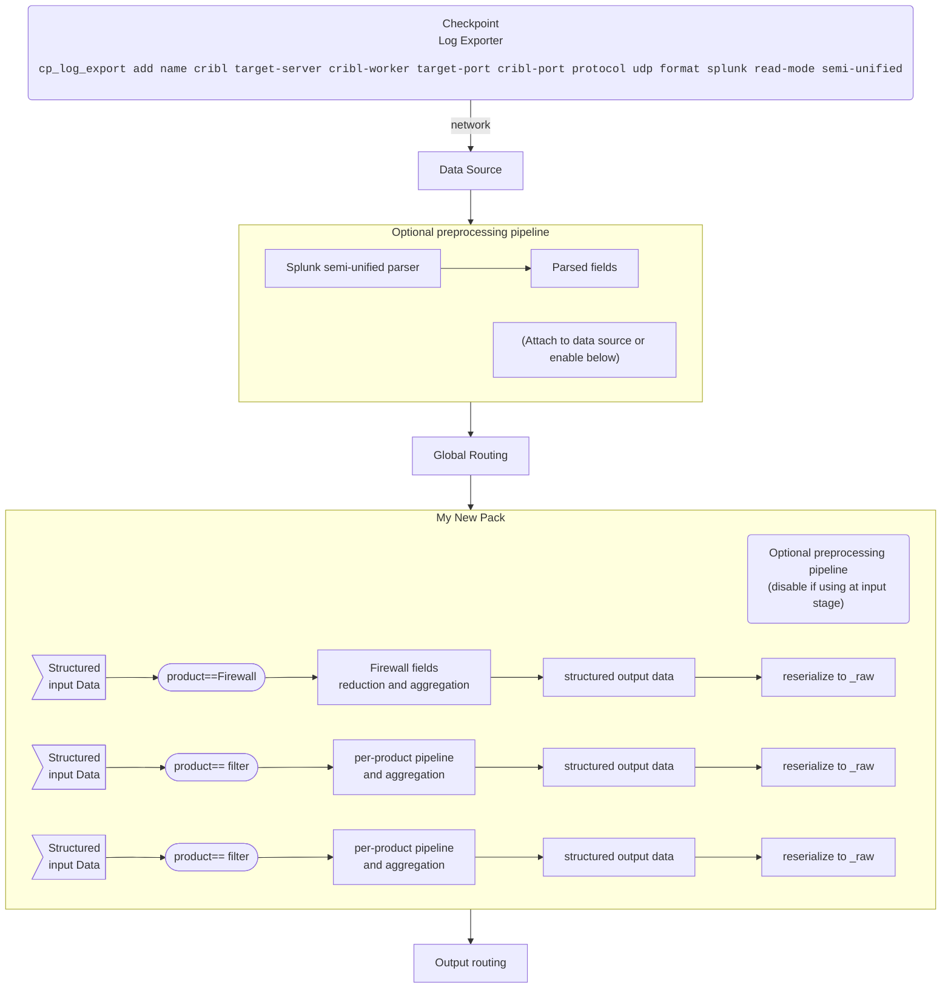

# Checkpoint pack
This pack filters and reduces log data from Checkpoint Log Exporter.

## Requirements
Checkpoint Log Exporter is configured as per <link> to send data in Splunk format and Semi-Unified mode.  See
https://supportcenter.checkpoint.com/supportcenter/portal?eventSubmit_doGoviewsolutiondetails=&solutionid=sk122323 for more
information on how to configure the log exporter

## Release Notes
I have never released this pack before

## Data Flow diagram

## Contributing to the Pack
Suggestions, comments, issues, and *especially* pull requests are welcome at https://github.com/jpvlsmv/cc-checkpoint-pack

## Contact
I can be reached via jpvlsmv@gmail.com

## License
This pack is released under the Apache-2 license, see LICENSE for details.
